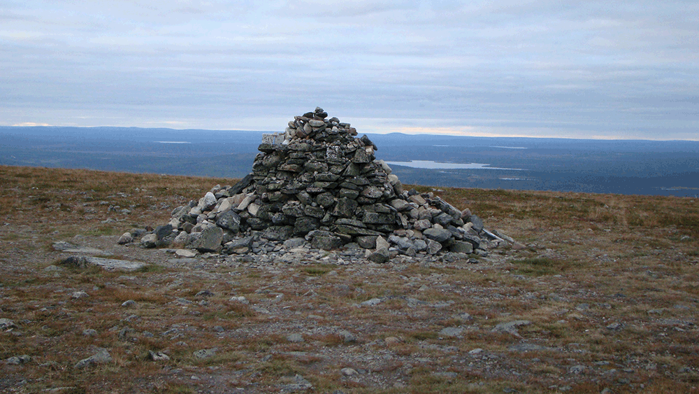

👋 Hi, I'm Casey! I am a collaborative leader with a decade of experience building organizations, transforming operations, and growing communities at the intersection of technology, art and design, and education.

✨ Some highlights of my career have included: leading operations at New York University's AI Now Institute, helping establish the School for Poetic Computation, and running an independent design and technology consultancy whose work has been exhibited at the Vienna Biennale, V&A Museum, and ArkDes.

👨‍🎨 In my work as an artist and educator, I've taught at The Cooper Union, exhibited at the Whitney Museum, been awarded a fellowship at the The New School's Center for Art and Politics, and have lectured at Yale University and Between Bridges Galerie in Berlin. As a designer and technologist, I was selected to participate in Triple Canopy’s inaugural Networked Publishing Intensive, and my writing has been published by Rhizome at The New Museum.

📚 I studied Art and Design at The Cooper Union, and I hold certificates in cooperative entrepreneurship and management from Mondragon University, among others.

🪨 * p.s. My banner image is the "Monument to Finnish Sisu". As an anonymous internet user once asked, on a now defunct blogspot: "What is so compelling about this pile of rocks that would inspire me to look at this picture so many times on any given day?" Sisu is a word from the Finnish language that is "ekphrastically untranslatable". (This means that there isn’t a word quite like it in the English language.) It stands for a combination of resilience, determination, making a plan and sticking to it, and continuing on against the odds. It has often been described as similar to "grit" or "equanimity" but — I love this part — with a “grimmer quality of stress management.
